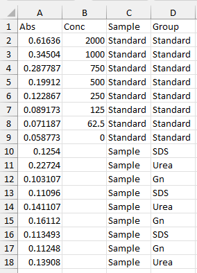
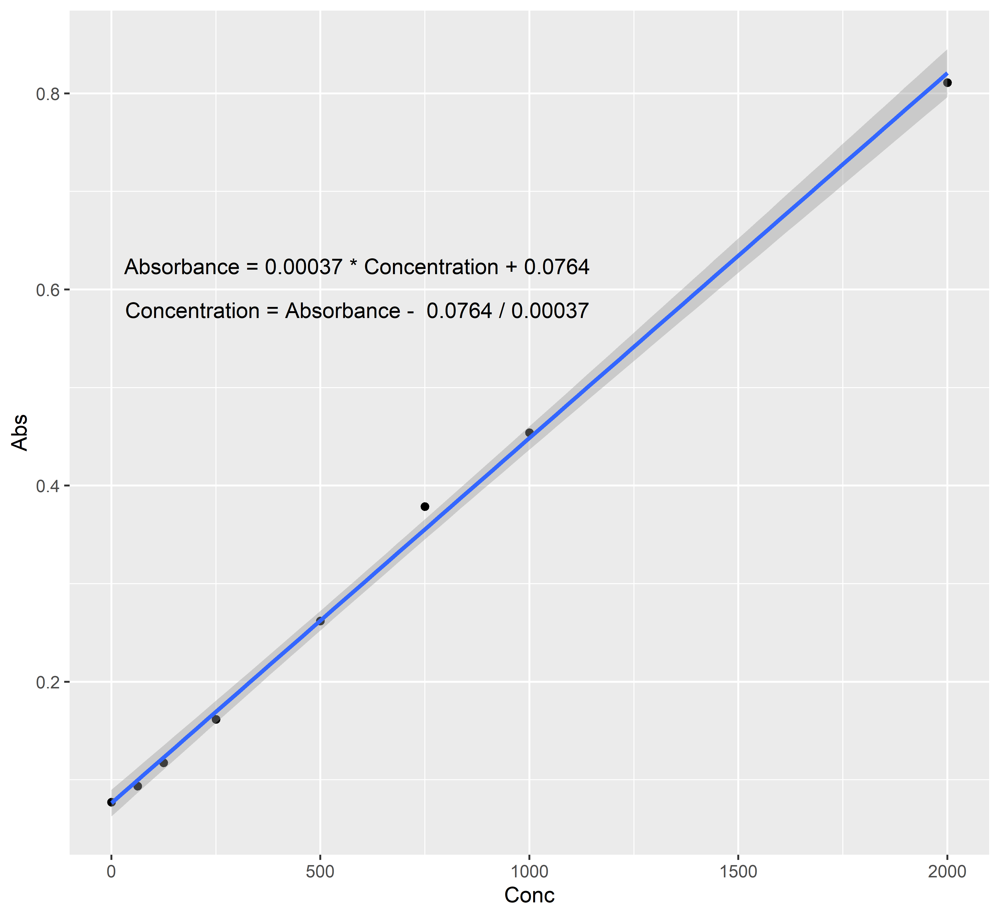
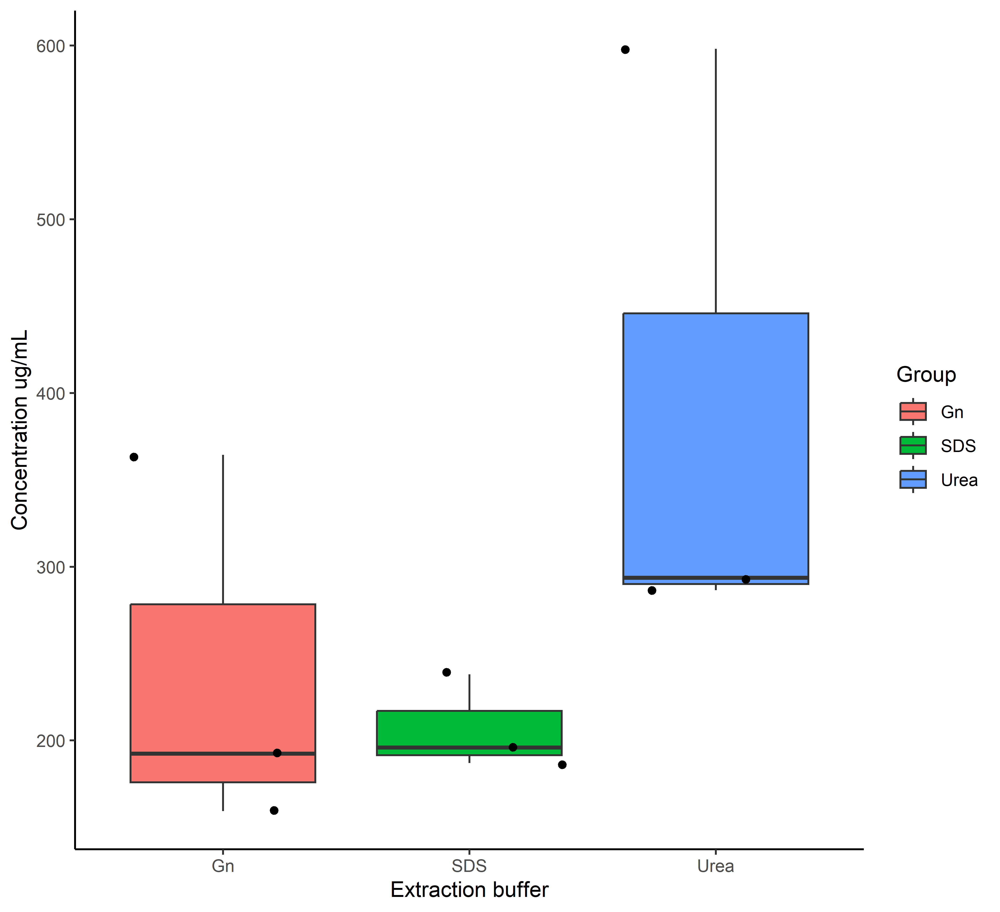

```{r setup, include=FALSE}
knitr::opts_chunk$set(echo = TRUE)
```

\begin{center}
\includegraphics[width=3cm, height=4.935cm]{../Images/liverpool logo.png}
\end{center}

\vspace{1cm}

\begin{center}
\textbf{\LARGE RStudio Tutorial}
\end{center}

\vspace{1cm}

\begin{center}
\textbf{\LARGE Protein assays}
\end{center}

\pagebreak

### Data preperation

After completing your protein assay and taking measurements be sure to save that data as an excel file. 

Then, using excel be sure to work out averages for each sample depending on how you ordered your triplicate samples. You can do this using RStudio, however it is probably easier using excel. 

Then and most importantly you need to make a datafram with the following columns; 

1) Absorbance - Average absorbance values
2) Concentration - At the stage only needed for standards
3) Sample - If value is a standard or a sample
4) Group - The experimental condition.

The following image shows an example setup: 



\pagebreak

### Loading data into RStudio

In order to load your data into RStudio you need to first set your working directory where your file is saved and then use the **readxl** package as shown below. 

```r
# Reading in data

## Load packages
library(ggplot2)
library(readxl)
library(dplyr)

## Setwd
setwd("C:/Users/hlajens2/Desktop/Lab work/Protein assays")

# Read in data 
df <- read_xlsx(path = "Tendon extraction buffer test data.xlsx", sheet = 3) 
```

You may need to install the package prior to this but you can do that with **install.packages**

After this you need to use your standard to make a linear model for calculating unknown solutions. 

```r
# Filter for standards
df_standard <- df %>% 
  filter(Sample == "Standard")

# Make model
model <- lm(formula = Abs~Conc, data = df_standard) 

# extract coefficients
gradient <- model$coefficients[2] 
intercept <- model$coefficients[1] 

# plot data
df_standard %>% 
  ggplot(aes(x = Conc, y = Abs))+
  geom_point()+
  geom_smooth(method = 'lm')+
  annotate(geom = 'text',
           x = max(df_standard$Conc)/3.4, # adjust if placement is off
           y = max(df_standard$Abs)/1.3, # adjust if placement is off
           label = paste("Absorbance =",
                        round(gradient, digits = 5),
                        "* Concentration +",
                        round(intercept, digits = 4)))+
  annotate(geom = 'text',
           x = max(df_standard$Conc)/3.4, # adjust if placement is off
           y = max(df_standard$Abs)/1.4, # adjust if placement is off
           label = paste("Concentration = Absorbance - ",
                        round(intercept, digits = 4),
                        "/",
                        round(gradient, digits = 5)))

# Save graph (This may change depending on directory)
ggsave(filename = paste0("name","LOBF", ".png"), 
       device = "png",
       dpi = 600,
       path = paste0(name, "/"))

```
{width="80%"}

\pagebreak

Now that you have this information you can begin to work out the unknown values. 

```r

# Use the model to calculate unknown concentrations
df_samples <- df %>% 
  filter(Sample == "Sample") %>% 
  mutate(Conc = (Abs - intercept)/gradient)

# Make box plot of data
df_samples %>% 
  ggplot(aes(x = Group, y = Conc))+
  geom_boxplot(aes(fill = Group))+
  geom_jitter()+
  theme_classic()+
  labs(x = "Extraction buffer", y = "Concentration (ug/mL)")


# Save graph (This may change depending on directory)
ggsave(filename = paste0(name,"RES", ".png"),
       device = "png",
       dpi = 600,
       path = paste0(name, "/"))

```


\pagebreak

The example used in this handbook is a lab experiment testing the effect of three different extraction buffers on protein extraction. Before attempting this you need to make sure your data is formatted to suit your work. If you are having any problems with this or the code is not working then visit the [KnowHow page](https://liverpool-knowhow.libcal.com/appointments/statsliverpool) for more help.

I hope this was useful, there are lots more R tutorials on my [website](https://ajensen14.github.io/) feel free to email me to request more RStudio tutorials. 


